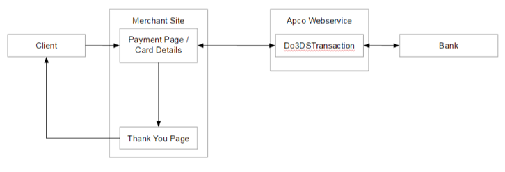
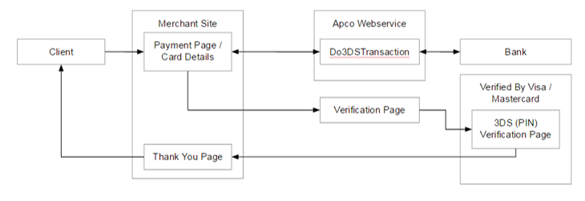
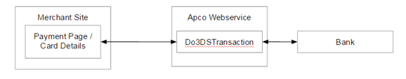

# ApcoPay PHP library

The ApcoPay PHP library provides the functionality to process financial transactions with the [ApcoPay](https://www.apcopay.eu/) gateway.

## Installation

The recommended method of installation is via [Packagist](https://packagist.org/) and [Composer](https://getcomposer.org/).
Run the following command to install the package and add it as a requirement to your project's `composer.json`:

```bash
composer require apcopay/apcopay_php
```

## Requirements

The PHP extension cURL is required.

## Description

### Initialization

The ApcoPayGateway configuration requires the following 5 parameters:

* Merchant id - The merchant id/code with ApcoPay
* Merchant password - The merchant password with ApcoPay
* Hashing secret - The hashing secret word with ApcoPay
* Notification url - The url that transaction status notifications are sent to. Should be processed as shown in the [notification request example](#Notification-request) below.
* Redirection url - The url the user is redirected to after a 3DS payment. Should be processed as shown in the [redirect request example](#Redirect-request) below.

#### Initialise ApcoPayGateway example

```php
$gateway = new ApcoPayGateway(
    new Configuration(
        "1234",
        "dfnu2345b2354vbu",
        "3ui423ui4",
        "https://merchanturl.com/apcopay/notification",
        "https://merchanturl.com/apcopay/redirect"
    )
);
```

### Process transaction

#### TransactionRequest

* `amount`
* `currency_code` - ISO 4217 numeric code
* `transaction_type` - Numeric code as defined [TransactionType](#Transaction-types) class
* `order_reference` - Merchant order reference. Must not contain ||
* `card_number`
* `card_cvv`
* `card_holder`
* `card_expiry_month`
* `card_expiry_year`
* `user_ip`
* `original_transaction_id` - The id of a prior transaction
* `user_defined_function` - Must not contain ||

##### TransactionRequest mandatory fields

|                           |amount|currency_code|transaction_type|order_reference|card_number|card_cvv|card_holder|card_expiry_month|card_expiry_year|user_ip|original_transaction_id|user_defined_function|
|---------------------------|------|-------------|----------------|---------------|-----------|--------|-----------|-----------------|----------------|-------|-----------------------|---------------------|
|   Purchase                |**Mandatory**|**Mandatory**|**Mandatory**|Recommended|**Mandatory**|Recommended|**Mandatory**|**Mandatory**|**Mandatory**|       |                       |                     |
|   Void Purchase           |      |             |**Mandatory**   |Recommended    |           |        |           |                 |                |       |**Mandatory**          |                     |
|   Authorisation           |**Mandatory**|**Mandatory**|**Mandatory**|Recommended|**Mandatory**|Recommended|**Mandatory**|**Mandatory**|**Mandatory**|       |                       |                     |
|   Capture                 |**Mandatory**|**Mandatory**|**Mandatory**|Recommended|           |        |**Mandatory**|               |                |       |**Mandatory**          |                     |
|   Void Credit             |      |             |**Mandatory**   |Recommended    |           |        |           |                 |                |       |**Mandatory**          |                     |
|   Void Capture            |      |             |**Mandatory**   |Recommended    |           |        |           |                 |                |       |**Mandatory**          |                     |
|   Void Authorisation      |      |             |**Mandatory**   |Recommended    |           |        |           |                 |                |       |**Mandatory**          |                     |
|   Repeat Purchase         |      |             |**Mandatory**   |Recommended    |           |        |           |                 |                |       |**Mandatory**          |                     |
|   Partial Refund          |      |             |**Mandatory**   |Recommended    |           |        |           |                 |                |       |**Mandatory**          |                     |
|   Original Credit         |      |             |**Mandatory**   |Recommended    |           |        |           |                 |                |       |**Mandatory**          |                     |
|   Repeat Authorisation    |      |             |**Mandatory**   |Recommended    |           |        |           |                 |                |       |**Mandatory**          |                     |

#### TransactionResponse

* `result` - Transaction result indicating the status of the transaction
* `psp_id` - Id of the transaction from the ApcoPay gateway
* `bank_transaction_id`  - Id of the transaction from the bank
* `date` - Date of transaction. Format: yyyyMMdd
* `time` - Time of transaction. Format: HHmmss
* `acquirer_reference`
* `authorization_code`
* `address_verification_response`
* `acquirer_code` - Processing bank code
* `user_ip`
* `user_defined_function`
* `extra_data`
* `card_country` - Card issuing country

#### Result codes

Accepted transactions can have one of the following results:

* APPROVED
* CAPTURED
* VOIDED
* ENROLLED (Only Used when the Card is 3Dsecure Enrolled and needs verification with Visa/MasterCard)

Declined transaction results will vary between banks

#### Process transaction example

```php
$transactionRequest = new TransactionRequest();
$transactionRequest->amount = "2.40";
$transactionRequest->currency_code = "978";
$transactionRequest->order_reference = "1234";
$transactionRequest->transaction_type = TransactionType::Purchase;

$transactionRequest->card_number = "4444444444444444";
$transactionRequest->card_cvv = "123";
$transactionRequest->card_holder = "John Doe";
$transactionRequest->card_expiry_month = "12";
$transactionRequest->card_expiry_year = "2023";

$transactionResponse = $gateway->processTransaction($transactionRequest);

if ($transactionResponse->result === "CAPTURED" || $transactionResponse->result === "APPROVED" || $transactionResponse->result === "VOIDED") {
    // Transaction successful
} else if ($transactionResponse->result == 'ENROLLED') {
    $redirectUrl = "https://www.apsp.biz/pay/3DSFP2/verify.aspx?id=" . $transactionResponse->psp_id;
    // Redirect to $redirectUrl
} else {
    // Transaction failed
}
```

### Notification request

>**Note:** The notification response should always return HTTP status code 200 with content OK

#### Notification request example

```php
$request = $_POST["params"];
$request = urldecode($request);
if (!$gateway->verify($request)) {
    die("Hash mismatch");
    return;
}
$notificationRequest = $gateway->parseNotification($request);
if ($notificationRequest->result === "OK") {
    // TODO: update order to successful
} else {
    // TODO: update order to declined
}
echo 'OK';
header("HTTP/1.1 200 OK");
```

### Redirect request

#### Redirect request example

```php
$request = $_GET["params"];
$request = str_replace("\\\"", "\"", $request);
if (!$gateway->verify($request)) {
    die("Hash mismatch");
    return;
}
$redirectRequest = $gateway->parseRedirect($request);
if ($redirectRequest->result === "OK") {
    echo '<div>Transaction successful</div>';
    echo '<div>Order reference: ' . $redirectRequest->order_reference . '</div>';
} else {
    echo '<div>Transaction failed</div>';
    echo '<div>Order reference: ' . $redirectRequest->order_reference . '</div>';
    echo '<div>Result: ' . $redirectRequest->result . '</div>';
}
```

## Process flow

### Normal transaction flow



### 3DS transaction flow

1. The Apco Pay web service will verify whether the card submitted is 3Dsecure ENROLLED

    1. If the card is not enrolled for 3ds, the web service will return a normal response described in the previous section

    1. If the card is enrolled the client needs to be redirected to the verification page https://www.apsp.biz/pay/3DSFP2/verify.aspx?id=4a502205024f474a8aa1933ceac42e56 Where Id needs to be replaced with the value that was returned in the first response

1. The Client must continue the verification and submit his PIN

1. After a successful verification the client is redirected the redirection_url in the configuration



### Reference transaction flow



## Transaction types

|   Name                    | Value |   Description                                                             |
|---------------------------|-------|---------------------------------------------------------------------------|
|   Purchase                |   1   |   Transfers value from the cardholders account                            |
|   Void Purchase           |   3   |   Cancellation of a purchase transaction – Before end of day              |
|   Authorisation           |   4   |   Reserve the specified value from the card holder                        |
|   Capture                 |   5   |   Transfers a reserved value from the cardholders account                 |
|   Void Credit             |   6   |   Cancel a credit - Before end of day                                     |
|   Void Capture            |   7   |   Cancel a capture - Before end of day                                    |
|   Void Authorisation      |   9   |   Cancel an authorization - Before end of day                             |
|   Repeat Purchase         |   11  |   Repeats a purchase by submitting the original PSPID                     |
|   Partial Refund          |   12  |   Reverse a partial/full amount of the original transaction               |
|   Original Credit         |   13  |   Pay out an amount greater than the amount of the original transaction   |
|   Repeat Authorisation    |   14  |   Repeats an authorization by submitting the original PSPID               |

### Transaction types in detail

#### Authorisation

Authorisation - Authorisation is the first part of a two-step process

If approved, the requested amount is reserved from the credit limit of the submitted card. The reservation process is therefore used if the capturing is to be completed at a later date.

**Important** - The authorisation (reservation) period is approx. 7 days for credit cards and 3 days for debit cards (we recommend that you check with the bank being used). Once the reservation period has expired, it is no longer possible to capture this transaction.

#### Capture

Capturing is the second step of the two-step process mentioned above. A capture transaction must be preceded by an "Authorisation" transaction.

The amount to be captured must be less than or equal to the authorized amount. This also means, that partial amounts can be captured.

During the capture, an amount is debited from the customer account and credited to the merchant account.

#### Purchase

Purchase is a payment transaction done in a single step.

The purchase transaction handles both an authorisation and a capture at the same time.

If approved, the requested amount is debited from the customer account and credited to the merchant account.

#### Partial Refund

Refunds are transactions that return the payments to the customer. The refunded amount can be a part of the paid amount or the full paid amount. Refunds can relate to an existing Capture or to a Purchase. In the case of credit card payments, refunds are credited to your customer's credit card account.

**Important** - Refunds are not allowed for gaming merchants.

#### Original Credit

The original credit is used to pay out an amount greater than the amount of the original transaction.

#### Void Purchase, Void Credit, Void Capture and Void Authorisation

If a Void request is executed by 23:59 (bank’s time zone) of the original transaction date - the acquirer would be able to cancel this transaction.

## Testing

|                                   |Card Number            |Expiry Date                        |CVV    |
|-----------------------------------|-----------------------|-----------------------------------|-------|
|Normal successful transaction      |4444 4444 4444 4444    |12/yy where yy is the current year |444    |
|Rejected normal transaction        |5555 5555 5555 5557    |12/yy where yy is the current year |444    |
|Successful 3DS transaction         |4444 4444 4444 2228    |12/yy where yy is the current year |444    |

## License

The ApcoPay PHP library is open-sourced software licensed under the [MIT license](https://opensource.org/licenses/MIT).
